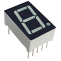

# Counter7SD 

The __Counter7SD__ is a hardware description of syncronouse counter.

# Pins Description
| Name | Direction |Description|
|---|---|---|
| cloack | input | |
|reset   | input  | synchrone low active: Signal switching counter to initial state |
|pause | input | synchrone low active: Signal switching counter to 'P' state, but after deactivating counter continues to work from previous state. |
|reverse| input|synchrone low active: Signal changes counter direction |
|data| output | It is intended to deduces counter state in display. 0-6 signals correspond to a-g indicators of 7SD.|

# Requirements
In development used the following software:
* icarus verilog -> [WebSite](http://iverilog.icarus.com/)
* GTKWave -> [WebSite](http://gtkwave.sourceforge.net/)
